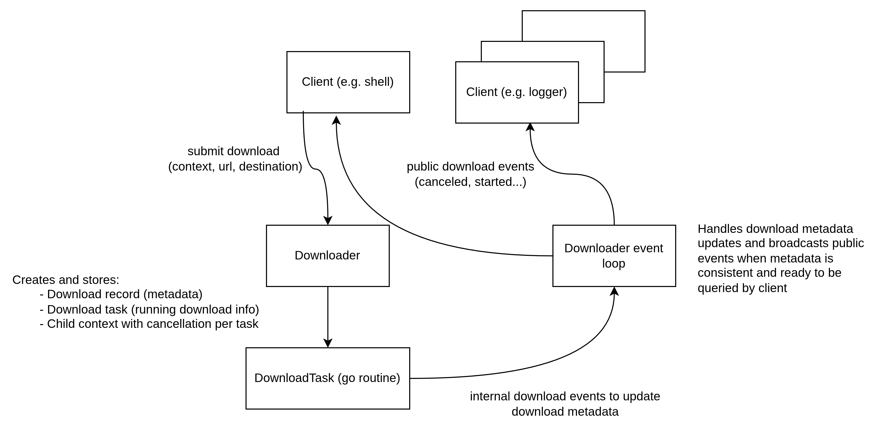

## HTTP Downloader

Projekt implementuje shell pro asynchronní stahování zdrojů pomocí HTTP,
podporující požadované příkazy jako `download`, `status`, `cancel`.

### Architektura a vybrané komponenty

Aplikace je navržena jako event-driven systém (zjednodušeně) s oddělením jádra a klientů (rozhraní, např. shellu).  
To, jak probíhá komunikace, je uvedeno na obrázku níže.



Teda hlavními komponenty jsou (vše se nachazejí v `pkg/downloader`)
- `Downloader`  
  Centrální komponenta, která řídí celý životní cyklus stahování.  
  Zpracovává události, aktualizuje stav a distribuuje informace klientům.

- `DownloadTask`  
  Dočasný worker běžící v samostatné gorutině.  
  Provádí samotné stahování (HTTP request + zápis na disk) a generuje interní události.

- `DownloadRecord`  
  Perzistentní metadata o stahování.  
  Uchovává stav (počet stažených bajtů, časy, chyby) a je dostupný pro dotazování i po dokončení stahování.

### Organizace projektu

Projekt je rozdělen na:

- `cmd/app`  
  Entrypoint aplikace

- `pkg/downloader`  
  Přepoužitelné jádro aplikace (logika stahování, eventy, správa stavu)

- `internal/shell`  
  Implementace CLI rozhraní (příkazy, formátování, interakce s uživatelem)

Toto rozdělení umožňuje použít downloader jako knihovnu nezávisle na klientech.

---

### Příklady využití knihovny (bez shellu)

Přímé využití jádra stahovače může vypadat následovně:

```go
d := downloader.NewDefaultDownloader(logger)
d.Start() // nastartování event smyčky (gorutiny)
id, _ := d.SubmitDownload(ctx, url, path)
ch, _ := d.GetCompletionChan(id)
<-ch
// stahování dokončeno
downloadMetadata, _ := d.GetDownload(id)
d.Shutdown(context.WithTimeout(...))
```

Příklad výše pro sledování dokončení stahování využívá kanály.
Alternativně lze sledovat průběh pomocí eventů, kde registrace může vypadat následovně:

```
go func() {
    externalEventsChan := d.Subscribe()
    for {
        select {
        case event := <-externalEventsChan:
            // obsahuje id, typ a data události
        case <-ctx.Done():
            return
        }
    }
}()
```
Funkční ukázky (včetně příkladu pro shutdown) jsou uvedeny v adresářích:
* `examples/01`
* `examples/02`

### Spuštění a použití shellu

Pro spuštění programu použijte:

```bash
go run cmd/app/main.go
```
Shell podporuje následující příkazy:
* `download <url> <path>` - zahájí stahování souboru
* `status` - vypíše přehled všech stahování
* `status <id>` - zobrazí detail konkrétního stahování (více metadat něž při `status`)
* `cancel <id>` - zruší probíhající stahování

Shell obsahuje základní nápovědu a autocomplete,
např. pro existující ID stahování nebo dříve použité URL a cílové cesty.

### Ukázka běhu
Výstup aplikace je uveden v:
- `docs/demo-run/console-log.txt`: obsah terminalu z videa
- `docs/demo-run/downloader.log|*with-cuts.log`: debug informace downloaderu
 
Ukázka běhu aplikace je dostupná ve videu níže:
[Video](docs/demo-run/demo-run.mp4)
